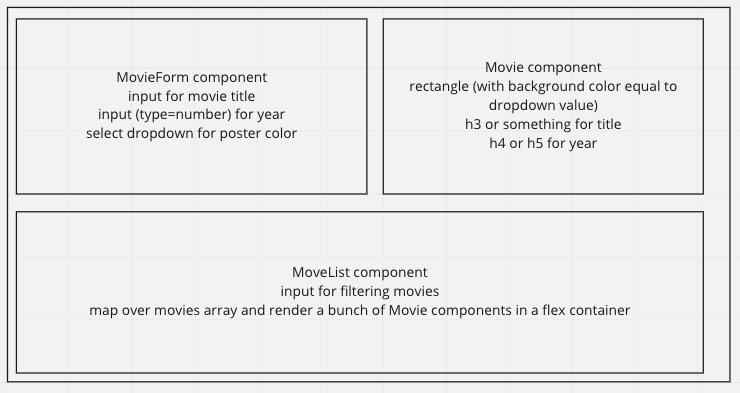

# Alchemy React Base Template

This project was bootstrapped with [Create React App](https://github.com/facebook/create-react-app).

Use this template for all your "from scratch" deliverables. To start, simply run

- `npm install`
- `npm start`

## Available Scripts

In the project directory, you can run:

### `npm start`

Runs the app in the development mode.\
Open [http://localhost:3000](http://localhost:3000) to view it in the browser.

The page will reload if you make edits.\
You will also see any lint errors in the console.

### `npm test`

Launches the test runner in the interactive watch mode.\
See the section about [running tests](https://facebook.github.io/create-react-app/docs/running-tests) for more information.

## Rubric

React Movie Builder App

- && conditional rendering
- filter on type
- allItems vs filteredItems. Why do we need two pieces of state?
- deleting items in an array
- list of clickables
- Note: when I delete from `movies`, it does not delete from our view until I refilter. That's because we don't delete from the same array we render from. To solve this problem correctly, we need to use `useEffect` to tell react: "Whenever my `allMovies` array changes, go ahead and re-filter my `filteredMovies`"
- That means this has a bug: when you delete an item from a filtered list, it does not leave the view until you refilter. For this assignment, that's okay!

| User should be able to . . .                                                         |             |
| :----------------------------------------------------------------------------------- | ----------: |
| Visit the deployed app on Netlify, with link in the About section of the Github repo |  **required for grading** |

| Events                                                                                |             |
| :----------------------------------------------------------------------------------- | ----------: |
| On changing the movie form, the movie preview updates |        1 |
| On submitting the movie form, a new movie is added to the view, the form clears out, and the preview resets |        2 |
| On clicking a movie the movie gets deleted  |        1 |
| On typing in the filter input, the movies are filtered by title|        2 |

| Components                                                                                |             |
| :----------------------------------------------------------------------------------- | ----------: |
| `App()` : tracks state for `allMovies`,  `filteredMovies`, `movieFormYearReleased`, `movieFormDirector`, `movieTitle`, `movieFormColor` |1|
| `App()` : passes state as props correctly to `MovieForm`, `Movie`, and `MovieList` |1|
| `App()` : define a `handleDeleteMovie` function that deleted a movie from the state array using title |2|
| `App()` : define a `handleFilterMovies` function that takes in a string and set `filteredMovies` to an array of movies whose name matches that string |2|
| `MovieForm({ setMovieFormName, movieFormYearReleased, setMovieFormTitle, movieFormDirector, setMovieFormColor, movieFormColor, submitMovie })` : on change for each input, call the appropriate state handler prop with the correct `e.target.value` to update `App.js` state.  |2|
| `MovieForm({ setMovieFormName, movieFormYearReleased, setMovieFormTitle, movieFormDirector, setMovieFormColor, movieFormColor, handleSubmitMovie })` : on submit, add a movie to state.  |2|
| `MovieList({ movies })` : takes in a `movies` prop and renders a list of `Movie` components. |1|
| `Movie({ movie })` : takes in a movie and renders it with the correct color background |1|

## The bug

- The problem: when I delete a movie from a filtered list, it does not delete from the view. That's because we render filtered movies, but we delete from all movies
- The solution: set it up so that whenever a movie is deleted, we filter again.
- That means we need to filter our movies whenever the state of movies changes. After all, if you delete a movie, that only deletes it from the movies, not the filtered array, which can cause problems when you try to delete something while the filter is active. We can achieve this using a useEffect
- So without useEffect, there is no good way to solve this bug. but you can still get full credit without solving the bug

## Stretch goal ideas

- Notice that if the filter is active, we cannot delete movies. Why is that? How might you fix that?
- `useEffect(() => filterMoviesByTitle(filterQuery), [filterQuery, allMovies]);` is the fix. Why does this work?
- Track the `query` as state. Use `useEffect` to filter the movies every time this query changes.
- What if instead of just adding movies to state, you added them to supabase and made your data persistent (fetching from supabase on load)?

## Plan

### Wireframes

### Components

- App
  - MovieForm
  - Movie
  - MovieList
    - Movie

### HTML

- MovieForm
  - form
  - maybe an h2 to title the form
  - Label/input x 2
  - select with 4 options (colors)
    - values of options should correspond to a background color
  - submit button
- Movie
  - h3 or h4 for movie title
  - h4-h6 or p tag for year
- MovieList
  - label/input for filtering
  - container for rendering the list of movies
